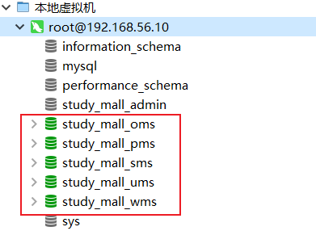
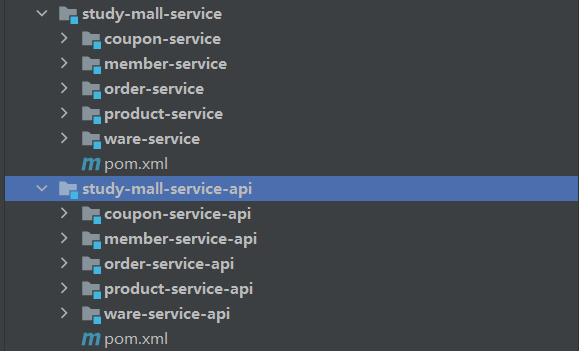

## 创建数据库

>  执行给定SQL脚本进行表和数据的初始化。创建数据库如图所示：



- 建议直接打开脚本粘贴内容到Navicat中执行，避免编码转换导致乱码问题


## 创建服务对应的模块



- 使用`service-api`模块抽取`entity`和`service`接口。便于后续扩展。


## 添加renren-generator逆向工程到项目

> 步骤与导入renren-fast一致，不再赘述。


## 使用renren-genetator逆向工程

修改`generator.properties`修改逆向工程基本属性。

修改`application.yml`配置数据库连接信息。


打开http://localhost，选中数据库表逆向生成代码，解压，并将`entity`,`service`导入到`service-api`模块。将`controller`、`dao`、`service.impl`导入到`service`模块


## 编写服务配置文件

在各服务下新建配置文件`bootstrap.properties`、`application.yml`、`application-dev.yml`

### bootstrap.properties

编写敏感数据配置。用于后期配置密码相关信息，暂时不填写


### application.yml

> 环境不敏感的信息放到application.yml中进行配置。示例如下：

```yaml
# Spring 配置
spring:
  profiles:
    active: dev
  application:
    name: coupon-servie

# 端口
server:
  port: 9010

# Mybatis-Plus 配置
mybatis-plus:
  mapper-locations: classpath:/mapper/**/*.xml
  global-config:
    db-config:
      id-type: auto
      logic-delete-value: 1
      logic-not-delete-value: 0
```


### application-dev.yml

> 环境敏感的数据放到对应环境配置文件中进行配置，示例如下：

```yaml

# 数据源配置
spring:
  datasource:
    url: jdbc:mysql://192.168.56.10:3306/study_mall_sms?useUnicode=true&characterEncoding=UTF-8&useSSL=false&serverTimezone=Asia/Shanghai
    username: root
    password: root
    driver-class-name: com.mysql.cj.jdbc.Driver
```


