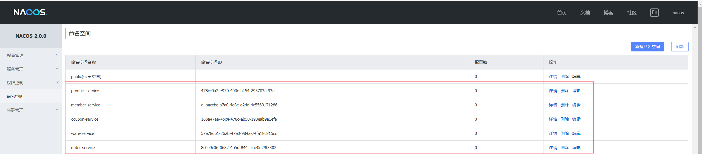
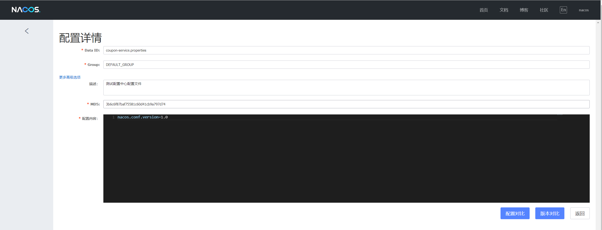
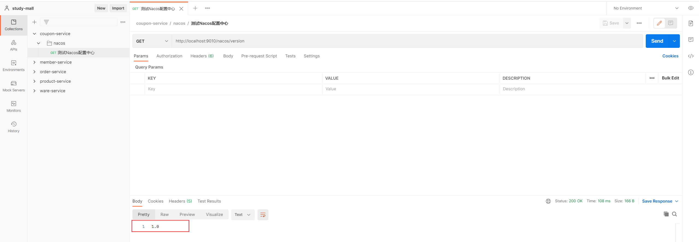
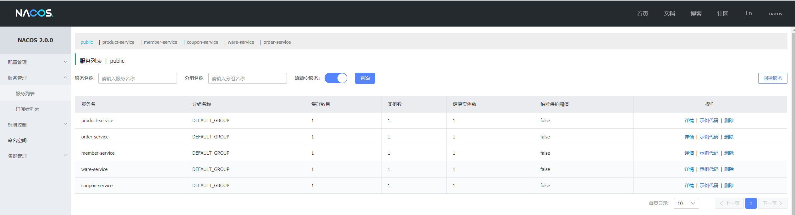
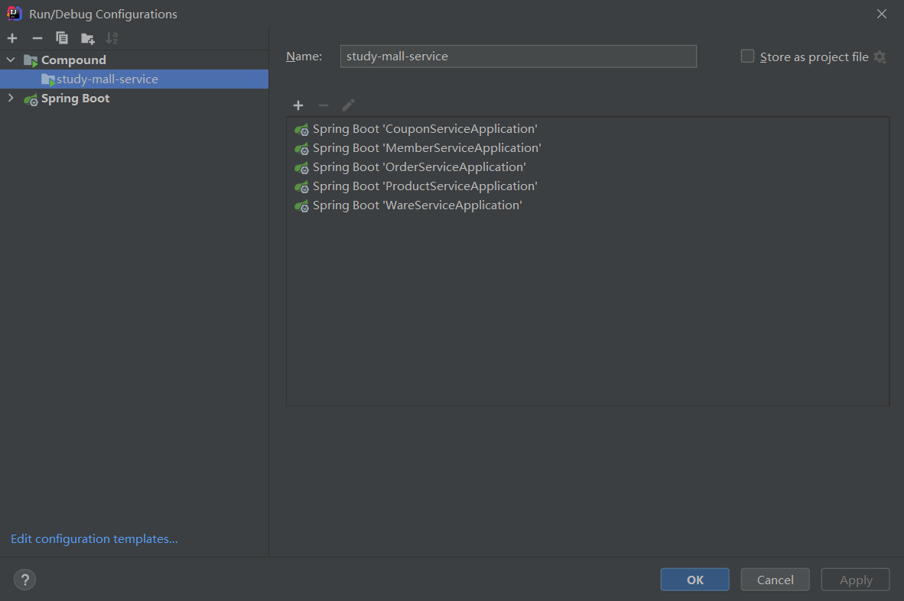

## 搭建Nacos服务

1. 下载Nacos[稳定版](https://github.com/alibaba/nacos/releases)压缩包

2. 上传至服务器

3. 解压

4. 修改application.properties文件

   ```properties
   #*************** Config Module Related Configurations ***************#
   ### If use MySQL as datasource:
   spring.datasource.platform=mysql
   
   ### Count of DB:
   db.num=1
   
   ### Connect URL of DB:
   db.url.0=jdbc:mysql://127.0.0.1:3306/nacos?characterEncoding=utf8&connectTimeout=1000&socketTimeout=3000&autoReconnect=true&useUnicode=true&useSSL=false&serverTimezone=UTC
   db.user.0=root
   db.password.0=root
   
   ```

5. 创建nacos数据库，并执行nacos/conf下的`nacos-mysql.sql`脚本进行初始化

6. 单机模式启动nacos。使用nacos/bin下的startup.sh启动

   ```bash
   ./bin/startup.sh -m standalone
   ```

7. 打开 http://192.168.50.10:8848/nacos ，默认用户名/密码为 `nacos/nacos`，查看Nacos控制台。


## 配置服务注册到Nacos

1. 打开Nacos控制台，新建命名空间如下：

   

2. 各微服务加入`common-nacos`依赖并编写配置文件,（在service父工程加入依赖可使子模块自动依赖）。示例如下：

   **bootstrap.properties**

   ```properties
   
   # Nacos 配置中心
   spring.cloud.nacos.config.server-addr=192.168.56.10:8848
   spring.cloud.nacos.config.namespace=16ba47ee-4bc4-478c-ab58-193eab9a1efe
   spring.application.name=coupon-service
   
   ```

   - **注：配置项namespace对应Nacos中的命名空间ID**


## 新建启动类

在各服务下新建启动类

```java
/**
 * 启动类
 */
@SpringBootApplication
@EnableDiscoveryClient
public class CouponServiceApplication {
    public static void main(String[] args) {
        SpringApplication.run(CouponServiceApplication.class, args);
    }
}

```

## 修改配置文件

> 修改 bootstrap.properties文件，加入配置中心地址以及服务名。服务名主要用于加载配置文件

```properties
# bootstrap.properties

# Nacos 配置中心
spring.cloud.nacos.config.server-addr=192.168.56.10:8848
spring.cloud.nacos.config.namespace=16ba47ee-4bc4-478c-ab58-193eab9a1efe
spring.application.name=coupon-service
```


> 修改application.yml，加入注册中心地址。

```yaml
# application.yml

# Spring 配置
spring:
  cloud:
    nacos:
      discovery:
        server-addr: 192.168.56.10:8848
```


## 测试

### 增加配置中心配置文件

打开Nacos控制台，在`coupon-service`命名空间下新建配置文件




### 新增测试Controller

```java
/**
 * 测试 Nacos 配置中心
 */
@RestController
@RequestMapping("nacos")
@RefreshScope
public class NacosController {

    @Value("${nacos.conf.version:0.0}")
    private String version;


    @GetMapping("version")
    public String getVersion() {
        return version;
    }
}
```


### 在postman中测试




### 注册中心功能




## IDEA启动类配置

在IDEA中配置启动项，如图，后续可以使用study-mall-service进行服务启动




## 将renren-fast加入到注册中心

> 1. 加入依赖
> 2. 启动类开启注册中心功能
> 3. 配置应用名称及注册中心地址

