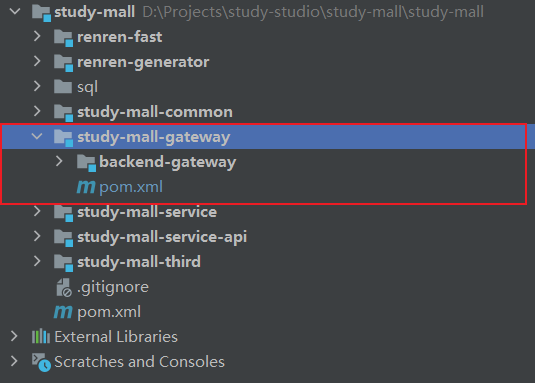
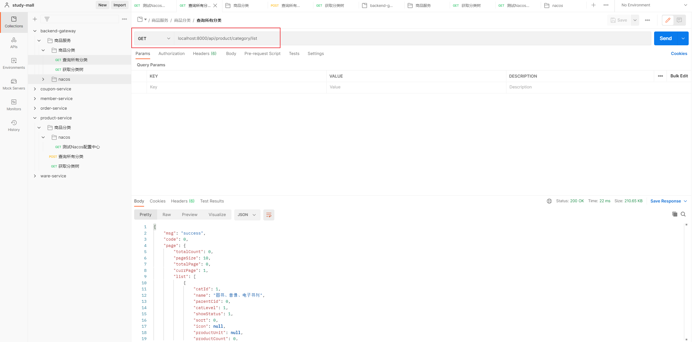

## 后端网关模块

### 新建模块

在`study-mall-gateway`下新建 `backend-gateway`模块



### 修改父模块配置

修改`pom.xml`为

```xml
<?xml version="1.0" encoding="UTF-8"?>
<project xmlns="http://maven.apache.org/POM/4.0.0"
         xmlns:xsi="http://www.w3.org/2001/XMLSchema-instance"
         xsi:schemaLocation="http://maven.apache.org/POM/4.0.0 http://maven.apache.org/xsd/maven-4.0.0.xsd">
    <parent>
        <artifactId>study-mall</artifactId>
        <groupId>cn.leithda</groupId>
        <version>1.0</version>
    </parent>
    <modelVersion>4.0.0</modelVersion>

    <artifactId>study-mall-gateway</artifactId>
    <description>
        网关聚合项目
    </description>

    <packaging>pom</packaging>

    <modules>
        <module>backend-gateway</module>
    </modules>

    <properties>
        <maven.compiler.source>8</maven.compiler.source>
        <maven.compiler.target>8</maven.compiler.target>
    </properties>

    <dependencies>
        <dependency>
            <groupId>cn.leithda</groupId>
            <artifactId>study-mall-common-gateway</artifactId>
            <version>1.0</version>
        </dependency>

        <dependency>
            <groupId>cn.leithda</groupId>
            <artifactId>study-mall-common-nacos</artifactId>
            <version>1.0</version>
        </dependency>

    </dependencies>

</project>
```

### 模块结构

```bash
├─backend-gateway
    ├─src
    │  ├─main
    │  │  ├─java
    │  │  │  └─cn
    │  │  │      └─study
    │  │  │          └─gateway
    │  │  │              └─conf
    │  │  │                └─BackendCorsConfiguration.java
    │  │  │              └─BackendGatewayApplication.java
    │  │  └─resources
    │  │  │  └─application.yml
    │  │  │  └─application-dev.yml
    │  │  │  └─bootstrap.properties
    │  └─test
    │      └─java
```


## 修改配置文件

**application.yml**

```yaml
# Spring 配置
spring:
  profiles:
    active: dev
  application:
    name: backend-gateway
  cloud:
    nacos:
      discovery:
        server-addr: 192.168.56.10:8848

# 端口
server:
  port: 8000

logging:
  level:
    com.alibaba.nacos.client.naming: error # 调整 nacos 注册中心日志级别
```

---


**application-dev.yaml**

> 配置转发规则

```yaml

spring:
  cloud:
    gateway:
      routes:
        - id: product_route
          uri: lb://product-service
          predicates:
            - Path=/api/product/**
          filters:
            - RewritePath=/api/(?<segment>.*),/$\{segment}

        - id: member_route
          uri: lb://member-service
          predicates:
            - Path=/api/member/**
          filters:
            - RewritePath=/api/(?<segment>.*),/$\{segment}

        - id: order_route
          uri: lb://order-service
          predicates:
            - Path=/api/order/**
          filters:
            - RewritePath=/api/(?<segment>.*),/$\{segment}

        - id: coupon_route
          uri: lb://coupon-service
          predicates:
            - Path=/api/coupon/**
          filters:
            - RewritePath=/api/(?<segment>.*),/$\{segment}

        - id: ware_route
          uri: lb://ware-service
          predicates:
            - Path=/api/ware/**
          filters:
            - RewritePath=/api/(?<segment>.*),/$\{segment}

        - id: admin_route
          uri: lb://admin-service
          predicates:
            - Path=/api/**
          filters:
            - RewritePath=/api/(?<segment>.*),/renren-fast/$\{segment}
```

---


**bootstrap.properties**

> 需要在配置中心添加命名空间

```properties

# Nacos 配置中心
spring.cloud.nacos.config.server-addr=192.168.56.10:8848
spring.cloud.nacos.config.namespace=59d1b576-ecbc-43f5-a3ff-e16776b0f90c
spring.application.name=backend-gateway
```


## 跨域设置

```java
/**
 * 后端跨域设置
 */

@Configuration
public class BackendCorsConfiguration {
    @Bean
    public CorsWebFilter corsWebFilter(){
        UrlBasedCorsConfigurationSource source = new UrlBasedCorsConfigurationSource();

        CorsConfiguration corsConfiguration = new CorsConfiguration();

        //1、配置跨域
        corsConfiguration.addAllowedHeader("*");
        corsConfiguration.addAllowedMethod("*");
        corsConfiguration.addAllowedOrigin("*");
        corsConfiguration.setAllowCredentials(true);

        source.registerCorsConfiguration("/**",corsConfiguration);
        return new CorsWebFilter(source);
    }
}
```

- 跨域统一由网关设置，取消renren-fast中的`CorsConfig`跨域设置，注释即可。


## 测试

启动所有项目



