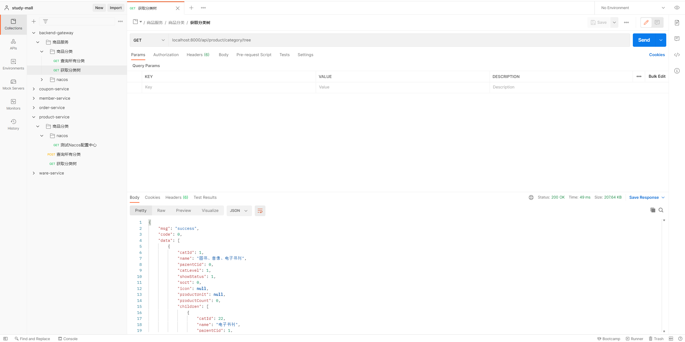

> 以商品为例：
>
> 编写查询分类树功能


1. 首先在CategoryEntity中增加子节点属性

   ```java
   public class CategoryEntity implements Serializable {
       //...
       /**
   	 * 子节点
   	 */
   	@TableField(exist = false)
   	private List<CategoryEntity> children;
   }
   ```

   - 注意在Entity中增加字段时，要使用`@TableField(exist = false)`标注这个字段不是数据库中存在的字段

2. 增加查询分类树接口

   ```java
   public interface CategoryService extends IService<CategoryEntity> {
       /**
        * 获取分类树
        * @param params 参数
        */
       List<CategoryEntity> tree(Map<String, Object> params);
   }
   ```

   

3. 编写实现

   ```java
   @Service("categoryService")
   public class CategoryServiceImpl extends ServiceImpl<CategoryDao, CategoryEntity> implements CategoryService {
       /**
        * 获取分类树
        * @param params 参数
        */
       @Override
       public List<CategoryEntity> tree(Map<String, Object> params) {
           List<CategoryEntity> categoryList = list();
           List<CategoryEntity> rootCategoryList = categoryList.stream()
                   .filter(categoryEntity -> categoryEntity.getParentCid() == 0)
                   .sorted(Comparator.comparingInt(CategoryEntity::getSort))
                   .collect(Collectors.toList());
   
           rootCategoryList.forEach(categoryEntity -> setCategoryChildren(categoryEntity, categoryList));
           return rootCategoryList;
       }
   
       /**
        * 设置分类的子节点
        *
        * @param parentCategory 父级分类
        * @param categoryList   所有节点
        */
       private void setCategoryChildren(CategoryEntity parentCategory, List<CategoryEntity> categoryList) {
           List<CategoryEntity> childrenCategoryList = categoryList.stream().filter(c -> c.getParentCid().equals(parentCategory.getCatId())).collect(Collectors.toList());
           parentCategory.setChildren(childrenCategoryList);
           childrenCategoryList.forEach(childCategory -> setCategoryChildren(childCategory, categoryList));
       }
   }
   ```

   

4. 增加控制器方法并调用

   ```java
   @RestController
   @RequestMapping("product/category")
   public class CategoryController {
       @Autowired
       private CategoryService categoryService;
   
       /**
        * 获取分类树
        */
       @RequestMapping("/tree")
       public R tree(@RequestParam Map<String, Object> params){
           List<CategoryEntity> tree = categoryService.tree(params);
           return R.ok().put("data", tree);
       }
   }
   ```

   

5. PostMan进行测试

   

- 这里直接通过网关进行调用进行测试

