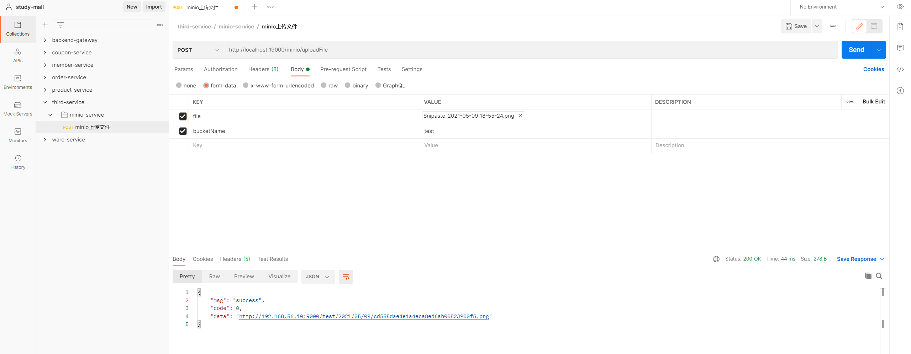

# Minio

[MinIO | 高性能，对Kubernetes友好的对象存储](http://www.minio.org.cn/)


## Docker安装Minio


1. 拉取MinIO镜像

   ```bash
   docker pull minio
   ```

   

2. 创建存储路径

   ```bash
   mkdir -p /home/dev/data/minio/conf /home/dev/data/minio/data
   ```

   

3. 启动MinIO

   ```bash
   docker run -p 9000:9000 --name minio \
     -e "MINIO_ACCESS_KEY=dev" \
     -e "MINIO_SECRET_KEY=c~Qo1~qa)b&m@" \
     -v /home/dev/data/minio/data:/data \
     -v /home/dev/data/minio/conf:/root/.minio \
     -d minio/minio server /data
   ```

   


## 搭建Minio后台服务

### 项目结构


## 文件服务

这里不贴全部代码了。

### 控制器MinioController

```java
@RestController
@RequestMapping("minio")
public class MinioController {

    @Autowired
    private MinioService minioService;

    @Autowired
    private MinioConfig minioConfig;

    /**
     * 使用minio上传文件
     * @param file 上传的文件
     * @param bucketName 对象存储桶名称
     */
    @PostMapping("/uploadFile")
    public R uploadFile(MultipartFile file, String bucketName) {
        try {
            bucketName = StringUtils.isNotBlank(bucketName) ? bucketName : minioConfig.getBucketName();
            if (!minioService.bucketExists(bucketName)) {
                minioService.makeBucket(bucketName);
            }
            String fileName = file.getOriginalFilename();
            String objectName = new SimpleDateFormat("yyyy/MM/dd/").format(new Date()) + UUID.randomUUID().toString().replaceAll("-", "")
                    + fileName.substring(fileName.lastIndexOf("."));
            minioService.putObject(bucketName, file, objectName);
            return R.ok().put("data",minioService.getObjectUrl(bucketName, objectName));
        } catch (Exception e) {
            e.printStackTrace();
            return R.error("上传失败");
        }
    }
}
```


## 测试



- 返回路径为图片请求路径。注意提前创建好对象存储桶并给与权限