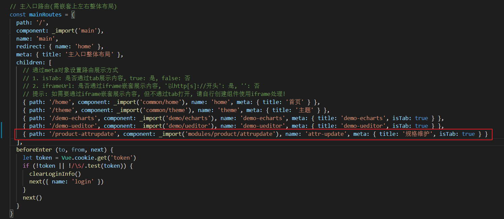

规格维护页面404解决办法：

1. 数据库增加对应菜单记录，id需要根据数据库记录自行修改

```sql
INSERT INTO sys_menu ( menu_id, parent_id, NAME, url, perms, type, icon, order_num )
VALUES
	( 82, 37, '规格维护', 'product/attrupdate', NULL, 2, 'log', 0 );
```


2. 前端修改

> 在 router/index.js中的增加配置
>
> 

