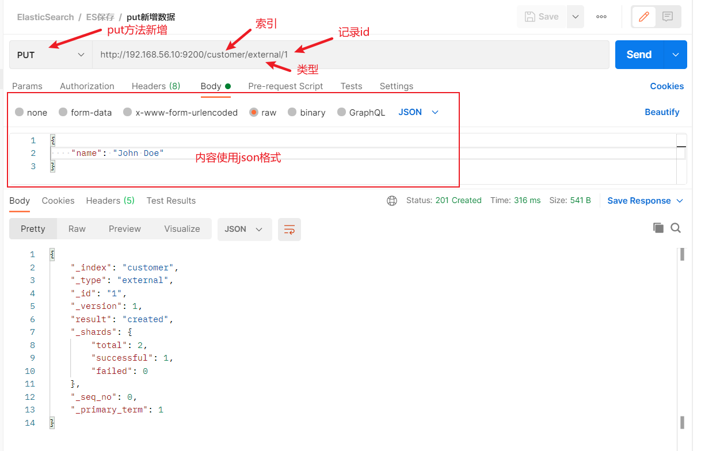

# 基础操作

## 保存数据

可以使用`put`、`post`进行数据的保存。

- put，必须带id，新增&保存
- post，不带id为新增，自动生成id，带id为新增&保存





## 查询数据

```http
GET http://192.168.56.10:9200/customer/external/1
```

相应如下：

```json
{
    "_index": "customer",		// 索引
    "_type": "external",		// 类型
    "_id": "1",					// id
    "_version": 1,				// 版本号
    "_seq_no": 0,				// 并发控制字段，每次更新+1，乐观锁
    "_primary_term": 1,			// 同上，主分配重新分配(如重启)，就会变化
    "found": true,				// 是否查询到
    "_source": { 				// 记录内容
        "name": "John Doe"
    }
}
```

- 更新可以携带`?if_seq_no=0&if_primary_term=1`进行并发控制。


## 修改数据

### _update更新

​	 对比原来数据，如果一致就什么都不处理，返回result为`noop`

```http
POST http://192.168.56.10:9200/customer/external/1/_update
{
    "doc": {
        "name": "John Minh" 
    }
}
```

​	

### 不带update更新

PUT和POST一致，直接更新，会变更版本号。

```http
POST http://192.168.56.10:9200/customer/external/1
{
	"name": "John Minh"
}
```


## 删除数据

```http
DELETE http://192.168.56.10:9200/customer/external/1
```


## 批量操作


```http
POST /customer/external/_bulk
{"index":{"_id":"1"}}
{"name":"John Doe"}
{"index":{"_id":"2"}}
{"name":"Kangkang"}

```

```http
POST /_bulk
{"delete":{"_index":"website","_type":"blog","_id":"123" }}
{"create":{"_index": "website", "_type": "blog", "_id": "123}} 
{"title": "Hy first blog post"}
{"index": { "_index": "website", "_type": "blog"}} 
{"title": "My second blog post"}
("update": { " _index": "website", "_type": "blog","_id":"123"}} 
{"doc" :{"title":"My updated blog post"}}

```


> 导入官方测试数据  https://gitee.com/ufo360/picgo2/raw/master/accounts.json 
>
> ```http
> POST /bank/account/_bulk
> 测试数据
> ```


# 进阶

## 两种查询

```http
GET bank/_search?q=*&sort=account_number:asc
```

```http
GET bank/_search
{
  "query": {
    "match_all": {}
  },
  "sort": [
    {
      "account_number": "asc"
    }
  ]
}
```


## Query DSL

### 基础语法

```http
GET bank/_search
{
  "query": {
    "match_all": {}
  },
  "sort": [
    {
      "balance": {
        "order": "desc"
      }
    }
  ],
  "from": 0,
  "size": 5
}
```


### _source返回部分字段

 ```http
 GET bank/_search
 {
   "query": {
     "match_all": {}
   },
   "sort": [
     {
       "balance": {
         "order": "desc"
       }
     }
   ],
   "from": 0,
   "size": 5,
    "_source": ["account_number","firstname","lastname","balance"]
 }
 ```


### match查询

```http
GET bank/_search
{
  "query": {
    "match": {
      "address": "mill lane"
    }
  }
}
## 全文检索按照评分进行排序，会对检索条件进行分词匹配
```


### match_phrase短语匹配

```http
GET bank/_search
{
  "query": {
    "match_phrase": {
      "address": "mill lane"
    }
  }
}
```


### muti_match 多字段匹配

```http
GET bank/_search
{
  "query": {
    "multi_match": {
      "query": "mill",
      "fields": ["address","state"]
    }
  }
}
## 多字段分词匹配
```


### bool 复合查询

```http
GET bank/_search
{
  "query": {
    "bool": {
      "must": [
        {
          "match": {
            "gender": "M"
          }
        },
        {
          "match": {
            "address": "mill"
          }
        }
      ],
      "must_not": [
        {
          "match": {
            "age": 28
          }
        }
      ],
      "should": [
        {
          "match": {
            "lastname": "Hines"
          }
        }
      ]
    }
  }
}
```


### filter 结果过滤

```http
GET bank/_search
{
  "query": {
    "bool": {
      "filter": [
        {"range": {
          "age": {
            "gte": 18,
            "lte": 30
          }
        }}
      ]
    }
  }
}
## filter 不会增加相关性得分
```


### term 查询

```http
GET bank/_search
{
  "query": {
    "term": {
      "age": {
        "value": 28
      }
    }
  }
}
## term用于检索精确值，不适合文本内容的匹配
```

- match_phrase短语匹配不是整词匹配（包含匹配）， FIELD.keyword为整词匹配（相等匹配）


### aggregations 执行聚合

 搜索address中包含mill的所有人的年龄分布以及平均年龄，但不显示这些人的详情。

```http
##  搜索address中包含mill的所有人的年龄分布以及平均年龄，但不显示这些人的详情。
GET bank/_search
{
  "query": {
    "match": {
      "address": "mill"
    }
  },
  "aggs": {
    "ageAgg": {
      "terms": {
        "field": "age",
        "size": 10
      }
    },
    "avgAgeAgg":{
      "avg": {
        "field": "age"
      }
    }
  },
  "size": 0
}
```


按照年龄聚合，并且求这些年龄段的人的平均薪资

```http
## 按照年龄聚合，并且求这些年龄段的人的平均薪资
GET bank/_search
{
  "query": {
    "match_all": {}
  },
  "aggs": {
    "ageAgg": {
      "terms": {
        "field": "age",
        "size": 100
      },
      "aggs": {
        "avgAgg": {
          "avg": {
            "field": "balance"
          }
        }
      }
    }
  },
  "size": 0
}
```


查出所有年龄分布，并且求出这些年龄段中M的平均薪资和F的平均薪资，以及总体的平均薪资

```http
## 查出所有年龄分布，并且求出这些年龄段中M的平均薪资和F的平均薪资，以及总体的平均薪资
GET bank/_search
{
  "query": {
    "match_all": {}
  },
  "aggs": {
    "ageAgg": {
      "terms": {
        "field": "age",
        "size": 100
      },
      "aggs": {
        "genderAgg": {
          "terms": {
            "field": "gender.keyword"
          },
          "aggs": {
            "genderAvgAgg": {
              "avg": {
                "field": "balance"
              }
            }
          }
        },
        "aggBalanceAgg":{
          "avg": {
            "field": "balance"
          }
        }
      }
    }
  },
  "size": 0
}
```


# 映射

## mapping 创建

> GET bank/_mapping 查看映射

```http
PUT /my-index
{
  "mappings": {
    "properties": {
      "age": {"type": "integer"},
      "email": {"type": "keyword"},
      "name":{"type": "text"}
    }
  }
}
## mapping创建
```


## 添加新的映射字段 

```http
PUT /my-index/_mapping
{
  "properties": {
    "employee-id": {
      "type": "keyword",
      "index": false
    }
  }
}
```


## 修改映射&数据迁移

已经存在的字段映射无法修改。


建立新索引

```http
PUT /newbank
{
  "mappings": {
    "properties": {
      "account_number": {
        "type": "long"
      },
      "address": {
        "type": "text"
      }
      // ... 省略部分字段
    }
  }
}
```


数据迁移

```http
POST _reindex
{
  "source": {
    "index": "bank",
    "type": "account"
  },
  "dest": {
    "index": "newbank"
  }
}
```


