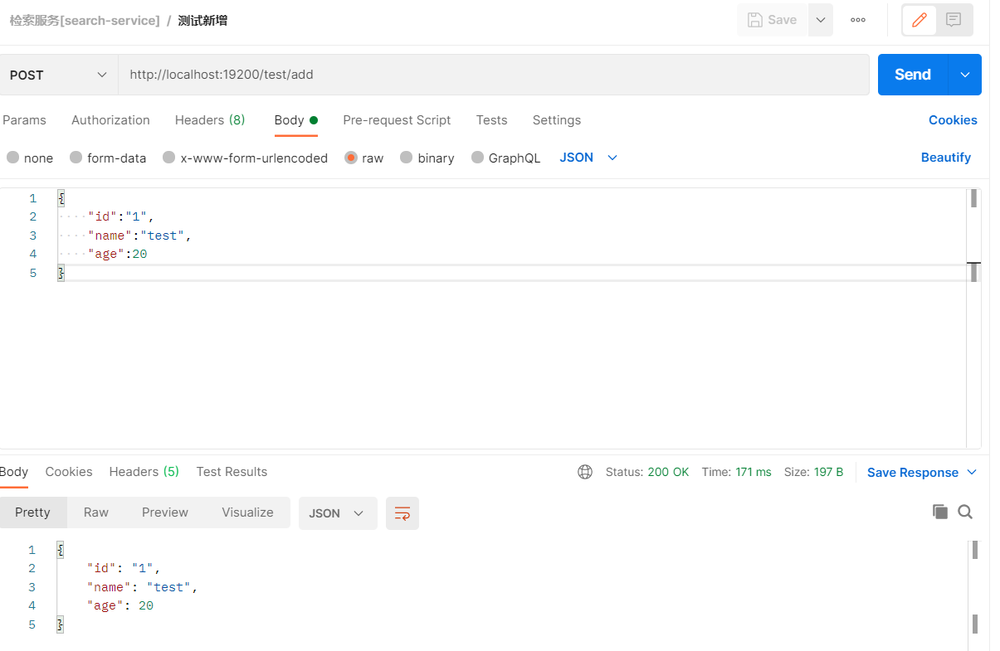

# SpringBoot整合ES

## 加入Maven依赖

```xml
        <dependency>
            <groupId>org.springframework.boot</groupId>
            <artifactId>spring-boot-starter-data-elasticsearch</artifactId>
        </dependency>
```


## 编写代码

### 实体类

```java
@Data
@Document(indexName = "test")
@ToString
public class TestEntity implements Serializable {

    @Id
    private String id;

    private String name;

    private Integer age;

}
```


### 数据操作接口

```java
@Repository
public interface TestRepository extends ElasticsearchRepository<TestEntity, String> {

}
```


### 服务接口及实现类

```java
public interface TestService {

    /**
     * 统计数量
     */
    long count();

    /**
     * 保存
     * @param testEntity 实体类
     */
    TestEntity save(TestEntity testEntity);

    /**
     * 删除
     * @param testEntity 实体类
     */
    void delete(TestEntity testEntity);

    /**
     * 列表
     */
    Iterable<TestEntity> getAll();

}


@Service
public class TestServiceImpl implements TestService {

    @Autowired
    TestRepository testRepository;

    //新增
    @Override
    public TestEntity save(TestEntity user) {
        return testRepository.save(user);
    }

    //删除
    @Override
    public void delete(TestEntity user) {
        testRepository.delete(user);
        //testRepository.deleteById(user.getId());
    }

    //查询总数
    @Override
    public long count() {
        return testRepository.count();
    }

    //查询全部列表
    @Override
    public Iterable<TestEntity> getAll() {
        return testRepository.findAll();
    }
}
```

### 表现层控制器

```java
@RestController
@RequestMapping("test")
public class TestController {

    @Autowired
    private TestService testService;


    //新增
    @PostMapping("add")
    public TestEntity testInsert(@RequestBody TestEntity entity) {
        return testService.save(entity);
    }

    //删除
    @PostMapping("delete")
    public void testDelete(@RequestBody TestEntity entity) {
        testService.delete(entity);
    }

    //查询总数
    @GetMapping("/getCount")
    public Long contextLoads() {
        return testService.count();
    }

    //查询全部列表
    @GetMapping("/getAll")
    public Iterable<TestEntity> testGetAll() {
        Iterable<TestEntity> iterable = testService.getAll();
        iterable.forEach(e->System.out.println(e.toString()));
        return iterable;
    }
}
```


## 使用PostMan测试接口并使用kibana进行验证

### 调用接口




### kibana查询

```http
POST /test/_search
{
  "query": {
    "match_all": {}
  }
}
```

```json
{
  "took" : 1,
  "timed_out" : false,
  "_shards" : {
    "total" : 1,
    "successful" : 1,
    "skipped" : 0,
    "failed" : 0
  },
  "hits" : {
    "total" : {
      "value" : 1,
      "relation" : "eq"
    },
    "max_score" : 1.0,
    "hits" : [
      {
        "_index" : "test",
        "_type" : "_doc",
        "_id" : "1",
        "_score" : 1.0,
        "_source" : {
          "_class" : "cn.study.search.entity.TestEntity",
          "id" : "1",
          "name" : "test",
          "age" : 20
        }
      }
    ]
  }
}
```


> 其他接口类似，此章节主要完成CRUD简单操作


## 复杂检索

> 具体编码可参考[Java REST Client (Elastic)](https://www.elastic.co/guide/en/elasticsearch/client/java-rest/master/index.html)
>
> 测试数据使用[18_ElasticSearch](./18_ElasticSearch常见操作.md#导入官方测试数据)中导入的测试数据章节。**已经导入的不用再次导入。**


代码如下：

```java
@SpringBootTest
@RunWith(SpringRunner.class)
public class SearchServiceApplicationTests {

    @Autowired
    private RestHighLevelClient client;

    @Test
    public void test() {
        System.out.println(client);
    }

    @Test
    public void searchData() throws Exception {
        // 1、创建检索请求
        SearchRequest searchRequest = new SearchRequest();
        // 指定索引
        searchRequest.indices("bank");
        // 指定检索条件
        SearchSourceBuilder sourceBuilder = new SearchSourceBuilder();

        // 1.1、构建检索条件
        sourceBuilder.query(QueryBuilders.matchQuery("address", "mill"));

        // 1.2、按照年龄的值分布聚合
        sourceBuilder.aggregation(AggregationBuilders.terms("ageAgg").field("age").size(10));

        // 1.3、按照平均薪资聚合
        sourceBuilder.aggregation(AggregationBuilders.avg("balanceAvg").field("balance"));

        System.out.println("检索条件：" + sourceBuilder);

        searchRequest.source(sourceBuilder);

        // 2、执行检索
        SearchResponse response = client.search(searchRequest, RequestOptions.DEFAULT);

        // 3、分析结果
        System.out.println(response);

        // 3.1、获取所有查到的结果
        SearchHits hits = response.getHits();
        hits.forEach(hit -> {
            String sourceAsString = hit.getSourceAsString();
            Account account = JSON.parseObject(sourceAsString, Account.class);
            System.out.println("account: " + account.toString());
        });

        // 3.2、获取聚合信息
        Aggregations aggregations = response.getAggregations();
        Terms ageAgg = aggregations.get("ageAgg");
        ageAgg.getBuckets().forEach(bucket -> {
            System.out.println("年龄：" + bucket.getKeyAsString() + "--> 数量： " + bucket.getDocCount());
        });

        Avg balanceAgg = aggregations.get("balanceAvg");
        System.out.println("平均薪资：" + balanceAgg.getValue());
    }

    @Data
    @ToString
    public static class Account {
        private int account_number;
        private int balance;
        private String firstname;
        private String lastname;
        private int age;
        private String gender;
        private String address;
        private String employer;
        private String email;
        private String city;
        private String state;
    }
}
```

