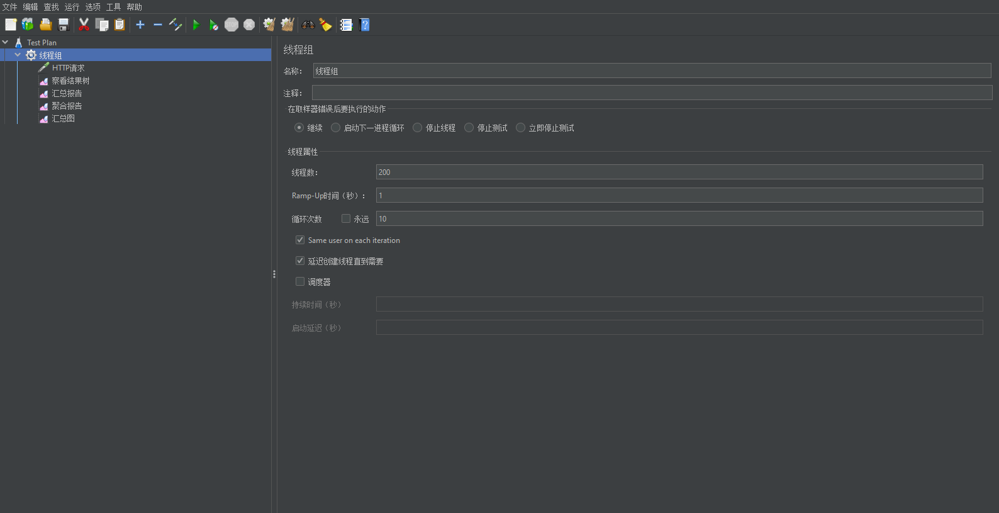
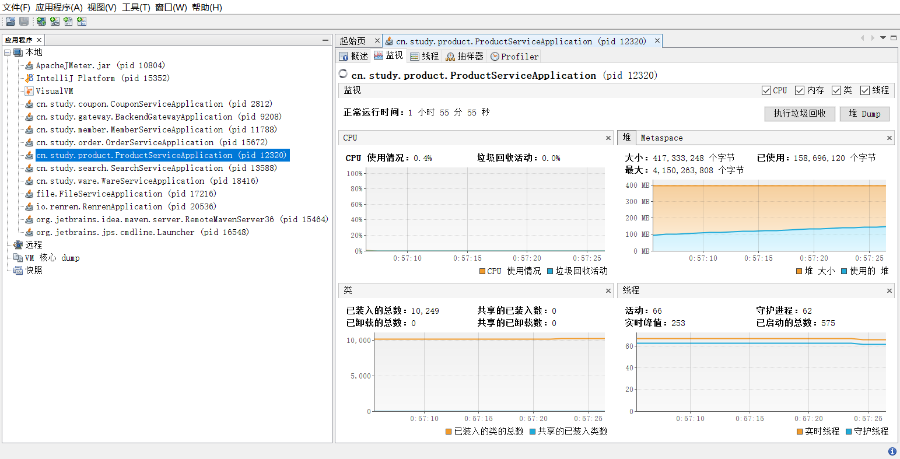

## 压力测试

> 使用JMeter进行压测，[Apache JMeter - Apache JMeter™](https://jmeter.apache.org/)

### 下载和安装

1. 下载JMeter[Apache JMeter - Download Apache JMeter](https://jmeter.apache.org/download_jmeter.cgi)
2. 解压，打开jmeter.bat
3. Options->choose Language->选择简体中文

### 进行压力测试

1. 创建测试计划，这里使用默认的Test Plan 计划

2. 右键，添加->线程(用户)->线程组

3. 线程组右键，添加->Http请求

   设置测试请求路径为`mall.com`

4. 线程组右键，添加->监听器->察看结果树|汇总报告|聚合报告

5. 启动测试请求，提示保存测试计划，保存即可

6. 运行测试，观察监听器统计数据

## 性能监控

### 工具

jconsole和jvisualvm(推荐使用)作为java提供的监控工具，位于jdk安装目录的bin目录下。

jvisualvm界面如图：

### 安装Visual GC插件

点击工具->插件->可用插件，安装Visual GC插件，安装好后退出程序，再次打开

