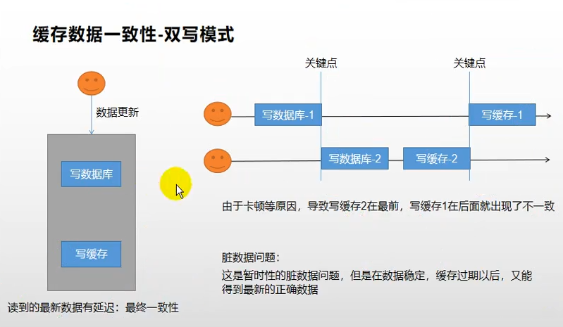
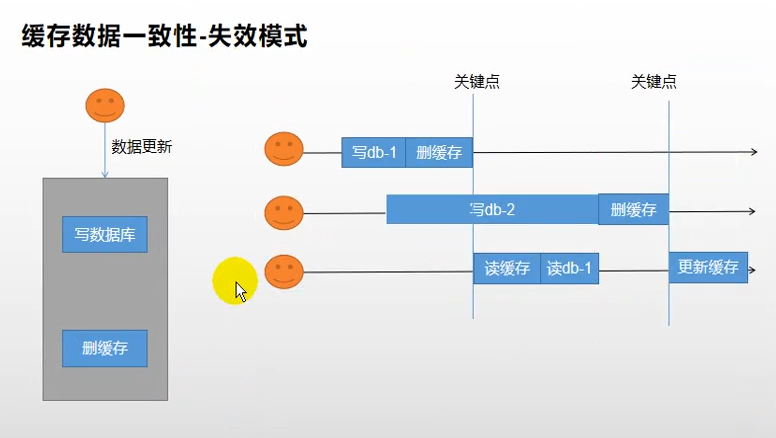

## 引入依赖并配置

### 引入依赖

```xml
<!-- Redisson 分布式对象框架 -->
<dependency>
    <groupId>org.redisson</groupId>
    <artifactId>redisson</artifactId>
    <version>3.15.4</version>
</dependency>
```


### 增加配置类

```java
@Configuration
public class RedissonConfig {

    @Bean(destroyMethod="shutdown")
    RedissonClient redisson() throws IOException {
        Config config = new Config();
        config.useSingleServer().setAddress("192.168.56.10:6379");
        return Redisson.create(config);
    }
}
```


### Redission分布式锁介绍

详情参照官方文档**[8. 分布式锁和同步器 · redisson/redisson Wiki (github.com)](https://github.com/redisson/redisson/wiki/8.-分布式锁和同步器)**


### 缓存一致性

缓存一致性解决方案：1）双写模式；2）失效模式。存在的问题如下：







### 缓存一致性解决方案

1. 如果用户维度数据(订单数据、用户数据)，这种并发几率非常小，不用考虑这个问题，缓存数据加上过期时间，每隔一段时间触发读的主动更新即可。
2. 如果是菜单、商品介绍等基础数据，可以使用canal订阅binlog的方式
3. 缓存数据+过期时间也足够解决大部分业务对于缓存的要求
4. 通过加锁保证并发读写，写写的时候按顺序排队，读读无所谓，所以适合使用读写锁（业务不关心脏数据，允许临时脏数据可忽略）

5. 总结
   - 我们能放入缓存的数据本就不应该是实时性、一致性要求超高的，所以缓存数据的时候加上过期时间
   - 不应该过度设计，增加系统的复杂性
   - 遇到实时性、一致性要求搞的数据，就应该插数据库，即使慢点
   - 当前系统使用，过期时间+分布式读写锁


