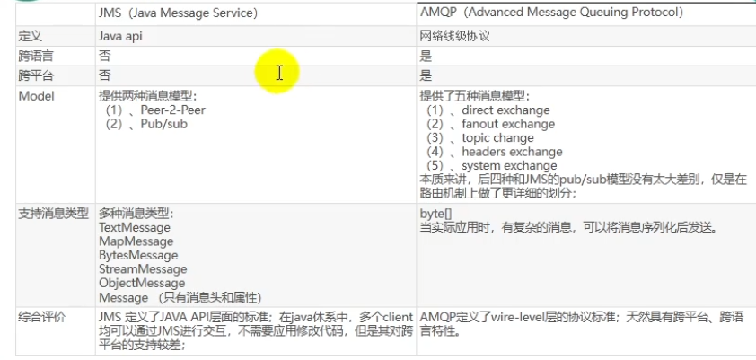
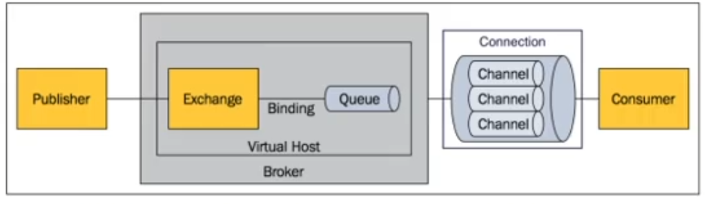
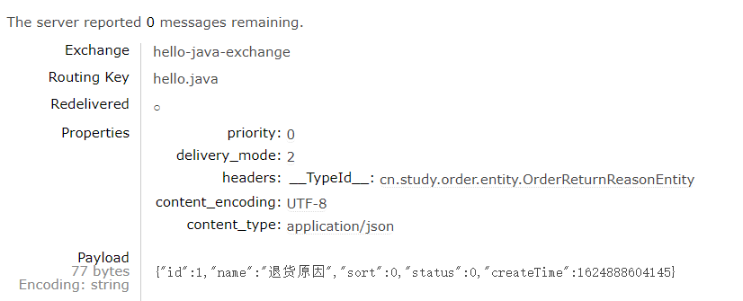

# RabbitMQ


## MQ应用场景

1. 异步处理
2. 应用解耦
3. 流量控制


## 概述

消息代理(Message Broker)：

目的地(Destination)：


目的地主要分为两种： queue和topic


点对点：

发布订阅：

JMS（Java Message Service）

AMQP（Advanced Message Queuing Protocol）




## 概念

- Message

消息，由消息头和消息体组成，消息体不透明，消息头有可选属性组成，主要有以下routing-key(路由键)、priority(优先级)、delivery-mode(持久化)属性


- Publisher

生产者，也是一个向交换器发布消息的客户端应用程序


- Exchange

交换器，用于接收生产者发送的消息并将这些消息路由给服务器中的队列。有四种类型direct(默认)、fanout、topic、headers。不同类型的交换器转发消息的策略有所区别

- Queue

消息队列，用来保存消息直到发送给消费者。它是消息的容器，也是消息的终点，一个消息可投入一个或多个队列。


- Binding

绑定，用于消息队列和交换器之间的关联。一个绑定就是基于路由键将交换器和消息队列连接起来的路由规则，所以可以将交换器理解成一个由路由构成的路由表。Exchange和Queue的绑定可以是多对多的关系。


- Collection

网络连接，比如一个TCP连接


- Channel

信道，多路复用连接中的一条独立的双向数据流通道。是建立在真实的TCP连接内的虚拟连接。操作系统建立和销毁TCP都是非常昂贵的开销，所以引入信道的概念，用来复用一条TCP连接。


- Consumer

消费者，表示一个从消息队列中取得消息的客户端应用程序。


- Virtual Host

虚拟主机，表示一批交换器、消息队列和相关对象。虚拟主机是共享相同身份认证和加密环境的独立服务器域。每个vhost本质上就是一个mini版的RabbitMQ服务器，拥有自己的队列、交换器、绑定和权限控制。vhost是AMQP概念的基础，必须在连接时指定。RabbitMQ默认的vhost是`/`。


- Broker

表示消息队列服务器实体





## RabbitMQ安装

安装的Docker命令

```bash
docker run -d --name rabbitmq -p 5671:5671 -p 5672:5672 -p 4369:4369 -p 25672:25672 -p 15672:15672 rabbitmq:management
```

- 4369，25672（Erlang发现&集群端口）
- 5672，5671（AMQP端口）
- 15672（web管理后台端口）
- 64613,64614（STOMP协议端口）
- 1883,8883（MQTT协议端口）
- 相关介绍 : https://www.rabbitmq.com/networking.html

> 安装完成后访问服务器的15672端口打开RabbitMQ的管理端界面


## Exchange交换机

direct(默认)、fanout、topic、headers

### direct

根据路由键精确匹配


### fanout

广播类型交换机，转发消息最快


### topic

发布订阅模式，通过模式匹配，


## SpringBoot整合RabbitMQ

1. 在订单服务中引入依赖：

```xml
<dependency>
    <groupId>org.springframework.boot</groupId>
    <artifactId>spring-boot-starter-amqp</artifactId>
</dependency>
```

2. `RabbitAutoConfiguration`类进行自动装配

3. 配置RabbitMQ连接信息

   ```yaml
   spring:
     rabbitmq:
       host: 192.168.56.10
       port: 5672
       virtual-host: /
   ```

   

4. 使用@EnableRabbit开启RabbitMQ功能


### AmqpAdmin的使用

使用单元测试进行简单的功能测试。

```java
@RunWith(SpringRunner.class)
@SpringBootTest
@Slf4j
public class OrderServiceApplicationTest {

    /**
     * 1、创建Exchange[hello-java-exchange]、Queue[hello-java-queue]、Binding
     *  1) AmqpAdmin 创建
     * 2、如何收发消息
     */

    @Autowired
    AmqpAdmin amqpAdmin;

    @Test
    public void createExchange(){
        // amqpAdmin
        // DirectExchange(String name, boolean durable, boolean autoDelete, Map<String, Object> arguments)
        DirectExchange directExchange = new DirectExchange("hello-java-exchange",true,false);
        amqpAdmin.declareExchange(directExchange);
        log.info("Exchange[{}]创建成功","hello-java-exchange");
    }

    @Test
    public void createQueue(){
        // Queue(String name, boolean durable, boolean exclusive, boolean autoDelete, @Nullable Map<String, Object> arguments)
        Queue queue = new Queue("hello-java-queue",true,false,false);
        amqpAdmin.declareQueue(queue);
        log.info("Queue[{}]创建成功","hello-java-queue");
    }

    @Test
    public void createBinding(){
        // Binding(String destination, Binding.DestinationType destinationType, String exchange, String routingKey, @Nullable Map<String, Object> arguments)
        Binding binding = new Binding("hello-java-queue", Binding.DestinationType.QUEUE,"hello-java-exchange","hello.java",null);
        amqpAdmin.declareBinding(binding);
        log.info("Binding[{}]创建成功","hello-java-binding");

    }
}
```


### 发送消息

```java
@Autowired
RabbitTemplate rabbitTemplate;

@Test
public void sendMessageTest(){
    // 1、发送消息，如果发送的消息是对象，使用序列化机制发送，需要实现Serializable接口
    String message = "Hello RabbitMQ";
    rabbitTemplate.convertAndSend("hello-java-exchange","hello.java",message);
    log.info("消息发送完成: {}",message);
}
```

- 发送对象默认使用Jdk序列化，可以通过如下配置设置为Json序列化

```java
@Configuration
public class RabbitConfig {

    /**
     * 配置RabbitMQ序列化器
     */
    @Bean
    public MessageConverter messageConverter(){
        return new Jackson2JsonMessageConverter();
    }
}
```

- 测试用例

```java
@Test
public void sendMessageTest(){
    // 1、发送消息，如果发送的消息是对象，使用序列化机制发送，需要实现Serializable接口
    OrderReturnReasonEntity orderReturnReasonEntity = new OrderReturnReasonEntity();
    orderReturnReasonEntity.setId(1L);
    orderReturnReasonEntity.setName("退货原因");
    orderReturnReasonEntity.setCreateTime(new Date());
    orderReturnReasonEntity.setStatus(0);
    orderReturnReasonEntity.setSort(0);
    rabbitTemplate.convertAndSend("hello-java-exchange","hello.java",orderReturnReasonEntity);
    log.info("消息发送完成: {}",orderReturnReasonEntity);
}
```




### 监听消息

使用@RabbitListener注解进行消息的监听

```java
@Component
public class TestReceive {

    @RabbitListener(queues = {"hello-java-queue"})
    public void receiveMessage(Object msg){
        System.out.println("接收到消息"+msg+" ==> 消息类型" + msg.getClass());
    }
}
```

- 将带有RabbitListener注解的方法放在Spring容器中


使用@RabbitHandler处理同一队列不同载体类型的消息

```java
@Component
@RabbitListener(queues = {"hello-java-queue"})
public class TestReceive {

    /**
     * queues：声明需要监听的队列
     * 消息类型为 org.springframework.amqp.core.Message
     *
     * 参数可以设置为以下内容
     * 1. Message message: 原生消息，包含消息头+消息体
     * 2. T t: 发送消息的类型，OrderReturnReasonEntity content
     * 3. Channel channel：当前传输数据的通道
     *
     * Queue：可以很多人来监听。只要收到消息，队列删除消息，只有一个人能收到此消息
     *  1） 订单服务启动多个,同一个消息，只能有一个客户端收到
     *  2) 只有一个消息处理完，方法运行结束，才可以接收下一个消息
     *
     */
//    @RabbitListener(queues = {"hello-java-queue"})
    @RabbitHandler
    public void receiveMessage(Message message, OrderReturnReasonEntity content, Channel channel) throws InterruptedException {
        //
        Thread.sleep(3000);
        System.out.println("接收到消息"+message+" ==> 内容" + content);
    }

    @RabbitHandler
    public void receiveMessage(OrderEntity orderEntity) throws InterruptedException {
        Thread.sleep(3000);
        System.out.println("接收到消息"+orderEntity);
    }
}
```

- 对应的发送消息的方法如下：

```java
@GetMapping("sendMq")
public String sendMq(@RequestParam(value = "num", defaultValue = "10") Integer num) {
    for (int i = 0; i < num; i++) {
        if (i % 2 == 0) {
            OrderReturnReasonEntity orderReturnReasonEntity = new OrderReturnReasonEntity();
            orderReturnReasonEntity.setId(1L);
            orderReturnReasonEntity.setName("退货原因" + i);
            orderReturnReasonEntity.setCreateTime(new Date());
            orderReturnReasonEntity.setStatus(0);
            orderReturnReasonEntity.setSort(0);
            rabbitTemplate.convertAndSend("hello-java-exchange", "hello.java", orderReturnReasonEntity);
            log.info("消息发送完成: {}", orderReturnReasonEntity);
        } else {
            OrderEntity orderEntity = new OrderEntity();
            orderEntity.setDeliverySn(UUID.randomUUID().toString());
            rabbitTemplate.convertAndSend("hello-java-exchange", "hello.java", orderEntity);
            log.info("消息发送完成: {}", orderEntity);
        }
    }
    return "ok";
}
```


