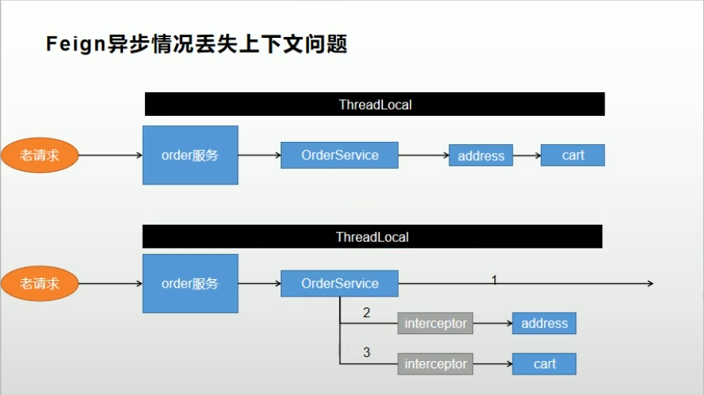

# 订单服务

## 前端环境搭建

设置订单服务前端动静分离，修改相关页面跳转连接


## 整合SpringSession

1，引入依赖；2，配置文件application.yml设置为redis；3，增加SessionConfig配置类，配置session信息；4，修改页面获取登录用户信息


## 订单服务登录拦截

订单服务需要登录后才能使用，因此使用拦截器对登录状态进行校验。

```java
@Component
public class LoginUserInterceptor implements HandlerInterceptor {

    public static ThreadLocal<UserInfoTo> threadLocal = new ThreadLocal<>();

    @Override
    public boolean preHandle(HttpServletRequest request, HttpServletResponse response, Object handler) throws Exception {
        UserInfoTo userInfoTo = new UserInfoTo();
        LinkedHashMap loginUser = (LinkedHashMap) request.getSession().getAttribute(AuthConstant.LOGIN_USER);
        if (Objects.nonNull(loginUser)) {
            // 用户登录
            userInfoTo.setUserId(Long.parseLong("" + loginUser.get("id")));
            threadLocal.set(userInfoTo);
            return true;
        }else{
            request.getSession().setAttribute("msg","请先登录");
            response.sendRedirect("http://auth.mall.com/login.html");
            return false;
        }
    }
}

// 添加拦截器
@Configuration
public class WebConfig implements WebMvcConfigurer {

    @Autowired
    LoginUserInterceptor loginUserInterceptor;

    @Override
    public void addInterceptors(InterceptorRegistry registry) {
        registry.addInterceptor(loginUserInterceptor).addPathPatterns("/**");
    }
}
```


## Feign远程调用请求头丢失问题

feign 在远程调用之前要构造请求，调用很多的拦截器。

核心方法`SynchronousMethodHandler`类的`#invoke` => `#executeAndDecode` => `#targetRequest`

```java
  Request targetRequest(RequestTemplate template) {
    for (RequestInterceptor interceptor : requestInterceptors) {
      interceptor.apply(template);
    }
    return target.apply(template);
  }
```


所以使用Feign拦截器增强Feign功能。

```java
@Configuration
public class OrderFeignConfig {
    @Bean
    public RequestInterceptor requestInterceptor(){
        return template -> {
            // 1、 使用 RequestContextHolder 获取请求信息
            ServletRequestAttributes requestAttributes = (ServletRequestAttributes) RequestContextHolder.getRequestAttributes();
            HttpServletRequest request = requestAttributes.getRequest();    // 老请求

            // 2、同步请求头信息
            template.header("Cookie",request.getHeader("Cookie"));
        };
    }
}
```

- 注入`RequestInterceptor`后，Spring会将其自动注入到`SynchronousMethodHandler`类中。


## Feign异步远程调用丢失请求头问题





- 使用异步编排任务后，新开的线程无法获得原线程中的上下文数据。
