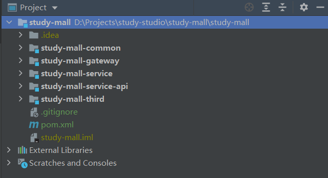

## 创建项目结构

创建如下项目结构

```bash
├─doc # 存放Markdown文件
└─study-mall # 后台项目
    ├─study-mall-common # 公共模块
    ├─study-mall-gateway # 网关模块
    ├─study-mall-service # 服务实现
    ├─study-mall-service-api # 服务接口及实体类
    └─study-mall-third # 第三方服务聚合模块
```

IntelliJ IDEA 中如图所示




## 引入renren-fast后台管理模块

### 克隆项目

进入到项目文件夹，使用`git clone git@gitee.com:renrenio/renren-fast.git`命令克隆renren-fast项目到本地。删除renren-fast中的`.git`文件夹


### 数据库初始化

新建数据库`study_mall_admin`，并在新建的数据库下执行`renren-fast`中的数据库脚本。


## 修改renren-fast配置文件

修改renren-fast中的MySQL、Redis配置。


## 修改父工程pom文件

```xml
    <modules>
        <!-- 加入renren-fast子模块 -->
        <module>renren-fast</module>
    </modules>
```


## 引入renren-fast-vue前端项目


### 克隆项目

```bash
# 克隆项目
git clone https://github.com/daxiongYang/renren-fast-vue.git

# 删除 renren-fast-vue下的 .git 文件夹
```


### 下载依赖

```bash
# 安装依赖
# 1
npm install -g cnpm --registry=https://registry.npm.taobao.org
# 2
cnpm install
```


### 启动测试

```bash
# 启动服务
npm run dev
```


